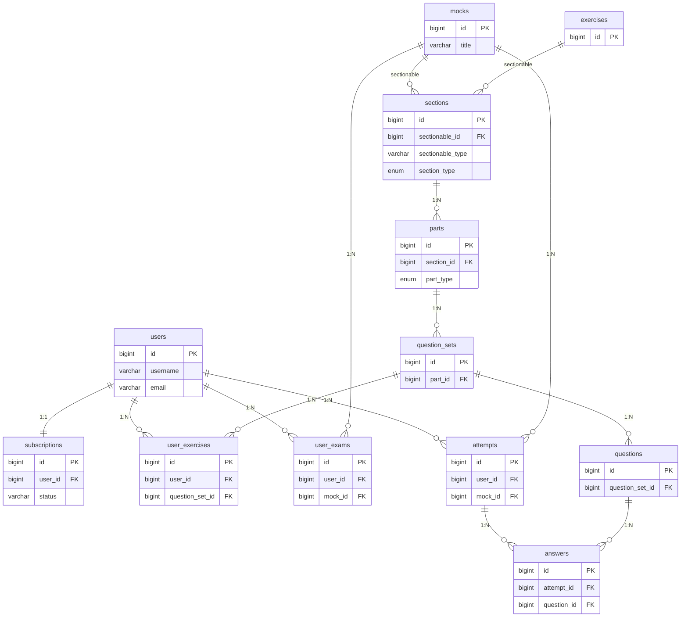

# データベース設計

## テーブル構成図

---

## テーブル詳細

### users

Deviseで管理。

| カラム名 | 型 | 制約 | 説明 |
|---|---|---|---|
| id | BIGINT | PK | |
| username | VARCHAR | NOT NULL | ユーザー名（重複可、変更可） |
| email | VARCHAR | NOT NULL, UNIQUE | メールアドレス |
| encrypted_password | VARCHAR | NOT NULL | Devise管理 |
| stripe_customer_id | VARCHAR | NULL, UNIQUE | Stripe Customer ID（サブスク・購入で共用） |
| reset_password_token | VARCHAR | UNIQUE | |
| reset_password_sent_at | TIMESTAMP | | |
| confirmation_token | VARCHAR | UNIQUE | |
| confirmed_at | TIMESTAMP | | |
| confirmation_sent_at | TIMESTAMP | | |
| unconfirmed_email | VARCHAR | | 変更中の未認証メールアドレス |
| remember_created_at | TIMESTAMP | | |
| created_at | TIMESTAMP | NOT NULL | |
| updated_at | TIMESTAMP | NOT NULL | |

> `stripe_customer_id` はサブスク開始時または模擬試験購入時に初回のみ作成。以降は同じCustomer IDを使い回す。

---

### mocks

| カラム名 | 型 | 制約 | 説明 |
|---|---|---|---|
| id | BIGINT | PK | |
| title | VARCHAR | NOT NULL | 例: 模擬試験 Vol.1 |
| created_at | TIMESTAMP | NOT NULL | 購入対象の決定に使用（最古の未購入が対象） |
| updated_at | TIMESTAMP | NOT NULL | |

---

### exercises

| カラム名 | 型 | 制約 | 説明 |
|---|---|---|---|
| id | BIGINT | PK | |
| created_at | TIMESTAMP | NOT NULL | |
| updated_at | TIMESTAMP | NOT NULL | |

タイトルは持たない。表示時に `section_type + part_type + display_order` から自動生成。

---

### sections

mock / exercises とポリモーフィック関連。

| カラム名 | 型 | 制約 | 説明 |
|---|---|---|---|
| id | BIGINT | PK | |
| sectionable_type | VARCHAR | NOT NULL | "Mock" または "Exercise" |
| sectionable_id | BIGINT | NOT NULL | |
| section_type | ENUM | NOT NULL | listening, structure, reading |
| display_order | INTEGER | NOT NULL | 表示順 |
| created_at | TIMESTAMP | NOT NULL | |
| updated_at | TIMESTAMP | NOT NULL | |

**インデックス:** `(sectionable_type, sectionable_id)`

---

### parts

| カラム名 | 型 | 制約 | 説明 |
|---|---|---|---|
| id | BIGINT | PK | |
| section_id | BIGINT | FK → sections.id, NOT NULL | |
| part_type | ENUM | NOT NULL | part_a, part_b, part_c, passages |
| display_order | INTEGER | NOT NULL | |
| created_at | TIMESTAMP | NOT NULL | |
| updated_at | TIMESTAMP | NOT NULL | |

---

### question_sets

| カラム名 | 型 | 制約 | 説明 |
|---|---|---|---|
| id | BIGINT | PK | |
| part_id | BIGINT | FK → parts.id, NOT NULL | |
| passage | TEXT | NULL | 読解パッセージ |
| audio_url | VARCHAR | NULL | 音声ファイルのS3 URL |
| display_order | INTEGER | NOT NULL | |
| created_at | TIMESTAMP | NOT NULL | |
| updated_at | TIMESTAMP | NOT NULL | |

---

### questions

| カラム名 | 型 | 制約 | 説明 |
|---|---|---|---|
| id | BIGINT | PK | |
| question_set_id | BIGINT | FK → question_sets.id, NOT NULL | |
| display_order | INTEGER | NOT NULL | |
| question_text | TEXT | NOT NULL | |
| audio_url | VARCHAR | NULL | 音声ファイルのS3 URL |
| choice_a | TEXT | NOT NULL | |
| choice_b | TEXT | NOT NULL | |
| choice_c | TEXT | NOT NULL | |
| choice_d | TEXT | NOT NULL | |
| correct_choice | ENUM | NOT NULL | A, B, C, D |
| explanation | TEXT | NULL | 解説 |
| created_at | TIMESTAMP | NOT NULL | |
| updated_at | TIMESTAMP | NOT NULL | |

---

### subscriptions

| カラム名 | 型 | 制約 | 説明 |
|---|---|---|---|
| id | BIGINT | PK | |
| user_id | BIGINT | FK → users.id, NOT NULL | |
| stripe_subscription_id | VARCHAR | NULL | |
| status | VARCHAR | NOT NULL | none, trial, premium, cancelled, expired (aasmで管理) |
| current_period_end | TIMESTAMP | NULL | 現在の課金期間終了日 |
| trial_ends_at | TIMESTAMP | NULL | トライアル終了日 |
| canceled_at | TIMESTAMP | NULL | 解約日時 |
| created_at | TIMESTAMP | NOT NULL | |
| updated_at | TIMESTAMP | NOT NULL | |

**インデックス:** `(user_id)` UNIQUE
> 1人のユーザーは常に **1つのレコード（1:1）** のみを持つ。再加入時などもこのレコードをアップデート・状態遷移させる。

---

### user_exercises

トライアル期間中の1日3セット制限を管理する消費ログ、および解答履歴（スコア）。

| カラム名 | 型 | 制約 | 説明 |
|---|---|---|---|
| id | BIGINT | PK | |
| user_id | BIGINT | FK → users.id, NOT NULL | |
| question_set_id | BIGINT | FK → question_sets.id, NOT NULL | |
| score | INTEGER | NULL | 正答数（完了時に記録） |
| status | VARCHAR | NOT NULL, DEFAULT: 'in_progress' | in_progress, completed (aasmで管理) |
| created_at | TIMESTAMP | NOT NULL | |
| updated_at | TIMESTAMP | NOT NULL | |

**残数判定ロジック:**
1. `user_id` と `created_at`（当日JST）でCOUNT
2. 3未満なら利用可能
3. 同じ `question_set_id` が既に存在すれば追加消費なし（途中再開対応）

---

### user_exams

| カラム名 | 型 | 制約 | 説明 |
|---|---|---|---|
| id | BIGINT | PK | |
| user_id | BIGINT | FK → users.id, NOT NULL | |
| mock_id | BIGINT | FK → mocks.id, NOT NULL | |
| stripe_checkout_session_id | VARCHAR | NULL | |
| stripe_payment_intent_id | VARCHAR | NULL | |
| status | VARCHAR | NOT NULL | pending, paid, failed (aasmで管理) |
| paid_at | TIMESTAMP | NULL | |
| created_at | TIMESTAMP | NOT NULL | |
| updated_at | TIMESTAMP | NOT NULL | |

**インデックス:** `(user_id, mock_id)` UNIQUE

---

### attempts

| カラム名 | 型 | 制約 | 説明 |
|---|---|---|---|
| id | BIGINT | PK | |
| user_id | BIGINT | FK → users.id, NOT NULL | |
| mock_id | BIGINT | FK → mocks.id, NOT NULL | |
| current_section | ENUM | NOT NULL, DEFAULT: listening | listening, structure, reading（再開時の表示セクション） |
| score | INTEGER | NULL | 合計スコア（completed時に算出） |
| status | VARCHAR | NOT NULL | in_progress, completed (aasmで管理) |
| completed_at | TIMESTAMP | NULL | |
| created_at | TIMESTAMP | NOT NULL | |
| updated_at | TIMESTAMP | NOT NULL | |

**インデックス:** `(user_id, mock_id)` UNIQUE

> **再開仕様:** `in_progress` 状態で無期限に再開可能。再開時は常にSection 1（Listening）から表示。既存の回答（answersテーブル）はそのまま復元される。タイマーはフルリセット（ペナルティなし）。`current_section` カラムはセクション遷移ボタン押下時に更新。

---

### answers

模擬試験の回答履歴。セクション別演習の回答は保存しない。

| カラム名 | 型 | 制約 | 説明 |
|---|---|---|---|
| id | BIGINT | PK | |
| attempt_id | BIGINT | FK → attempts.id, NOT NULL | |
| question_id | BIGINT | FK → questions.id, NOT NULL | |
| selected_choice | ENUM | NULL | A, B, C, D（未回答はNULL） |
| is_correct | BOOLEAN | NULL | 正誤判定 |
| created_at | TIMESTAMP | NOT NULL | |
| updated_at | TIMESTAMP | NOT NULL | |

**インデックス:** `(attempt_id, question_id)` UNIQUE
