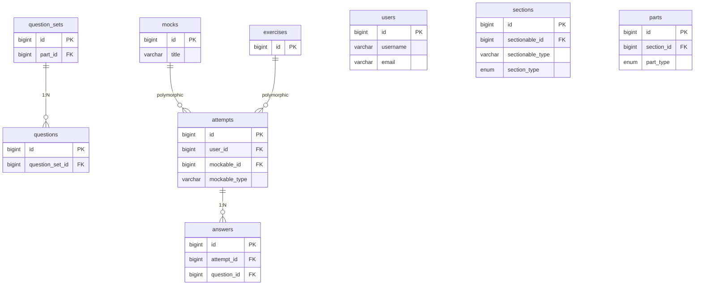

# データベース設計

## テーブル構成図

---

## テーブル詳細

### users

Deviseで管理。

| カラム名 | 型 | 制約 | 説明 |
|---|---|---|---|
| id | BIGINT | PK | |
| username | VARCHAR | NOT NULL | ユーザー名（重複可、変更可） |
| email | VARCHAR | NOT NULL, UNIQUE | メールアドレス |
| encrypted_password | VARCHAR | NOT NULL | Devise管理 |
| reset_password_token | VARCHAR | UNIQUE | |
| reset_password_sent_at | TIMESTAMP | | |
| confirmation_token | VARCHAR | UNIQUE | |
| confirmed_at | TIMESTAMP | | |
| confirmation_sent_at | TIMESTAMP | | |
| unconfirmed_email | VARCHAR | | 変更中の未認証メールアドレス |
| remember_created_at | TIMESTAMP | | |
| created_at | TIMESTAMP | NOT NULL | |
| updated_at | TIMESTAMP | NOT NULL | |

---

### mocks

| カラム名 | 型 | 制約 | 説明 |
|---|---|---|---|
| id | BIGINT | PK | |
| title | VARCHAR | NOT NULL | 例: 模擬試験 Vol.1 |
| created_at | TIMESTAMP | NOT NULL | |
| updated_at | TIMESTAMP | NOT NULL | |

---

### exercises

| カラム名 | 型 | 制約 | 説明 |
|---|---|---|---|
| id | BIGINT | PK | |
| created_at | TIMESTAMP | NOT NULL | |
| updated_at | TIMESTAMP | NOT NULL | |

タイトルは持たない。表示時に `section_type + part_type + display_order` から自動生成。

---

### sections

mock / exercises とポリモーフィック関連。

| カラム名 | 型 | 制約 | 説明 |
|---|---|---|---|
| id | BIGINT | PK | |
| sectionable_type | VARCHAR | NOT NULL | "Mock" または "Exercise" |
| sectionable_id | BIGINT | NOT NULL | |
| section_type | ENUM | NOT NULL | listening, structure, reading |
| display_order | INTEGER | NOT NULL | 表示順 |
| created_at | TIMESTAMP | NOT NULL | |
| updated_at | TIMESTAMP | NOT NULL | |

**インデックス:** `(sectionable_type, sectionable_id)`

---

### parts

| カラム名 | 型 | 制約 | 説明 |
|---|---|---|---|
| id | BIGINT | PK | |
| section_id | BIGINT | FK → sections.id, NOT NULL | |
| part_type | ENUM | NOT NULL | part_a, part_b, part_c, passages |
| display_order | INTEGER | NOT NULL | |
| created_at | TIMESTAMP | NOT NULL | |
| updated_at | TIMESTAMP | NOT NULL | |

---

### question_sets

| カラム名 | 型 | 制約 | 説明 |
|---|---|---|---|
| id | BIGINT | PK | |
| part_id | BIGINT | FK → parts.id, NOT NULL | |
| passage | TEXT | NULL | 読解パッセージ |
| audio_url | VARCHAR | NULL | 音声ファイルのS3 URL |
| display_order | INTEGER | NOT NULL | |
| created_at | TIMESTAMP | NOT NULL | |
| updated_at | TIMESTAMP | NOT NULL | |

---

### questions

| カラム名 | 型 | 制約 | 説明 |
|---|---|---|---|
| id | BIGINT | PK | |
| question_set_id | BIGINT | FK → question_sets.id, NOT NULL | |
| display_order | INTEGER | NOT NULL | |
| question_text | TEXT | NOT NULL | |
| audio_url | VARCHAR | NULL | 音声ファイルのS3 URL |
| choice_a | TEXT | NOT NULL | |
| choice_b | TEXT | NOT NULL | |
| choice_c | TEXT | NOT NULL | |
| choice_d | TEXT | NOT NULL | |
| correct_choice | ENUM | NOT NULL | A, B, C, D |
| explanation | TEXT | NULL | 解説 |
| created_at | TIMESTAMP | NOT NULL | |
| updated_at | TIMESTAMP | NOT NULL | |

---

---

### attempts

模擬試験およびセクション別演習の解答履歴。

| カラム名 | 型 | 制約 | 説明 |
|---|---|---|---|
| id | BIGINT | PK | |
| user_id | BIGINT | FK → users.id, NOT NULL | |
| mockable_type | VARCHAR | NOT NULL | "Mock" または "Exercise" |
| mockable_id | BIGINT | NOT NULL | |
| completed_at | TIMESTAMP | NULL | |
| created_at | TIMESTAMP | NOT NULL | |
| updated_at | TIMESTAMP | NOT NULL | |

**インデックス:** `(user_id, mockable_type, mockable_id)` UNIQUE

> **再開仕様:** セクション遷移ごとに回答をDBに保存するため、中断後の再開時は保存済みの回答を読み込んだ状態で（Section 1から）開始される。
> **回答保存:** セクション移動時または完了時に、そのセクションの全件回答を `answers` テーブルに UPSERT（更新または作成）する。

---

### answers

模擬試験およびセクション別演習の回答履歴。

| カラム名 | 型 | 制約 | 説明 |
|---|---|---|---|
| id | BIGINT | PK | |
| attempt_id | BIGINT | FK → attempts.id, NOT NULL | |
| question_id | BIGINT | FK → questions.id, NOT NULL | |
| selected_choice | ENUM | NULL | A, B, C, D（未回答はNULL） |
| is_correct | BOOLEAN | NULL | 正誤判定 |
| created_at | TIMESTAMP | NOT NULL | |
| updated_at | TIMESTAMP | NOT NULL | |

**インデックス:** `(attempt_id, question_id)` UNIQUE
